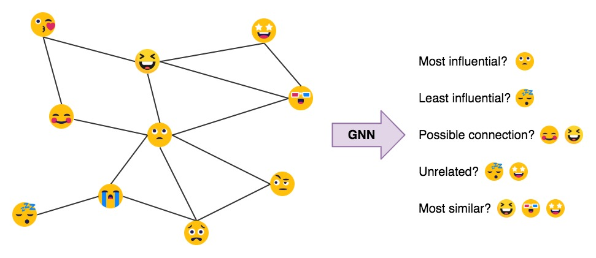
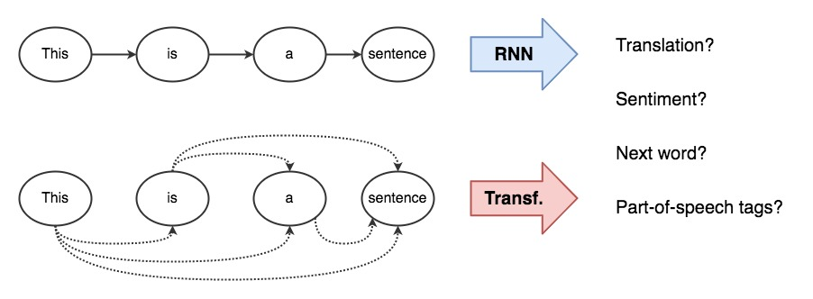
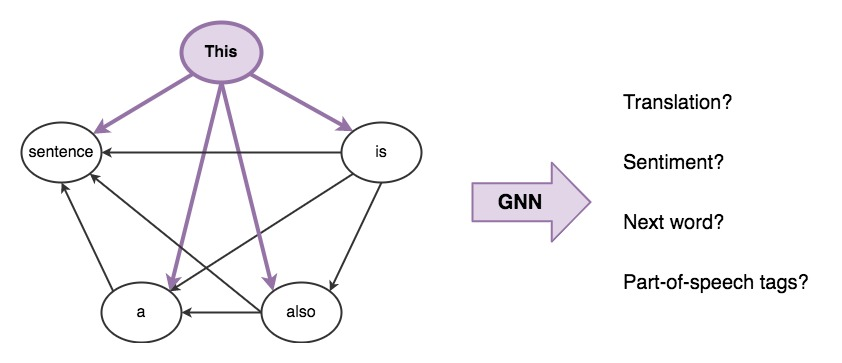

Research friends often ask me: Graph Deep Learning sounds great, but are there any big compercial success stories? Is it being deployed in practical applications?
Besides the obvious ones--recommendation systems at [Pinterest](https://arxiv.org/abs/1806.01973), [Alibaba](https://arxiv.org/abs/1902.08730) and [Twitter](https://blog.twitter.com/en_us/topics/company/2019/Twitter-acquires-Fabula-AI.html)--a slightly nuanced success story is the [Transformer architecture](https://arxiv.org/abs/1706.03762), which has [taken](https://openai.com/blog/better-language-models/) [the](https://www.blog.google/products/search/search-language-understanding-bert/) [NLP](https://www.microsoft.com/en-us/research/project/large-scale-pretraining-for-response-generation/) [world](https://nv-adlr.github.io/MegatronLM) [by](https://blog.einstein.ai/introducing-a-conditional-transformer-language-model-for-controllable-generation/) [storm](https://ai.facebook.com/blog/roberta-an-optimized-method-for-pretraining-self-supervised-nlp-systems/).

Through this post, I want to establish links between Graph Neural Networks (GNNs) and Transformers.
I'll talk about the intuitions behind model architectures in the GNN and NLP communities, make connections using formal equations, and discuss how we can work together to drive progress.
Let's start by thinking about what model architectures are designed to do.

---

### GNNs build representations of graphs

[Graph Neural Networks]() build representations of graph nodes through neighborhood aggregation (or message passing), where each node gathers features from its neighbors to represent local graph structure.
Stacking several GNN layers enables the model to propagate each nodes's features from its neighbors to the neighbors' neighbors, and so on.
Take the example of a social network: 
The final node embeddings produced by the GNN can be used for predictive tasks such as identifying the most influential network members or proposing potential links. 

$$ 
h_{i}^{\ell+1} =  \sigma \Big( U^{\ell} h_{i}^{\ell} + \sum_{j \in \mathcal{N}(i)} \left( V^{\ell} h_{j}^{\ell} \right)  \Big) 
$$

---

### Transformers build representations of sentences

### Sentences are fully-connected word graphs

---

### More Resources

To dive deep into the Transformer architecture, watch this [thorough video overview](https://www.youtube.com/watch?v=iDulhoQ2pro) or check out these amazing blog posts: [The Annotated Transformer](http://nlp.seas.harvard.edu/2018/04/03/attention.html) and [The Illustrated Transformer](http://jalammar.github.io/illustrated-transformer/). (Or [this comprehensive list](https://github.com/sannykim/transformers) of resources to study the Transformer.)

This blog isn't the first to highlight the connection between GNNs and Transformers:
Here's [an excellent talk](https://ipam.wistia.com/medias/1zgl4lq6nh) by Arthur Szlam on the history of Attention, Memory Networks and Transformers.
Similarly, DeepMind's [star-studded position paper](https://arxiv.org/abs/1806.01261) introduces the Graph Networks framework, unifying all these ideas.
For a code walkthrough, the DGL team has [a nice tutorial](https://docs.dgl.ai/en/latest/tutorials/models/4_old_wines/7_transformer.html) on building the Transformer as a GNN (and [a related paper](https://arxiv.org/abs/1911.04070) on making the implementation efficient).

Finally, we wrote [a recent paper]() applying Transformers to sketch graphs. Do check it out!

<!-- 
Are fc graphs the best representation
Is working on fc graphs somehow akin to learning the graph structure, and thus discovering syntax (link to chris manning work, google brain work)
What choice of attention mechanisim is best (Luong investigated this years ago, but not in context of multi head models)
What are multiple heads doing? Do they help with bad init, or do they look at different aspects or facilitate different types of messages to propogate?
What is the overparameterized FC layer? Why is that the only place where they use non-linearities?
Can we use ideas such as MHA and Pw-FF in designing more powerful GNNs? E.g. can we benefit from encoding graph features such as node degree akin to position encodings in text? E.g.2. can we use BERT style special tokens at each layer to build represenations of sub-graphs/graphs?
Why did they decide on a particular way of doing batch norm after residual conex? And is that why we need warmup?
 -->
